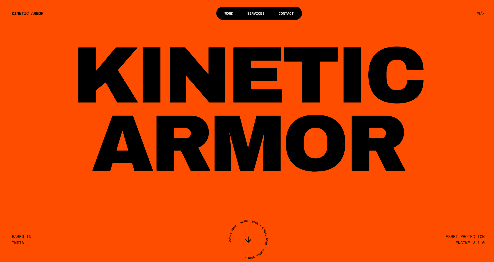
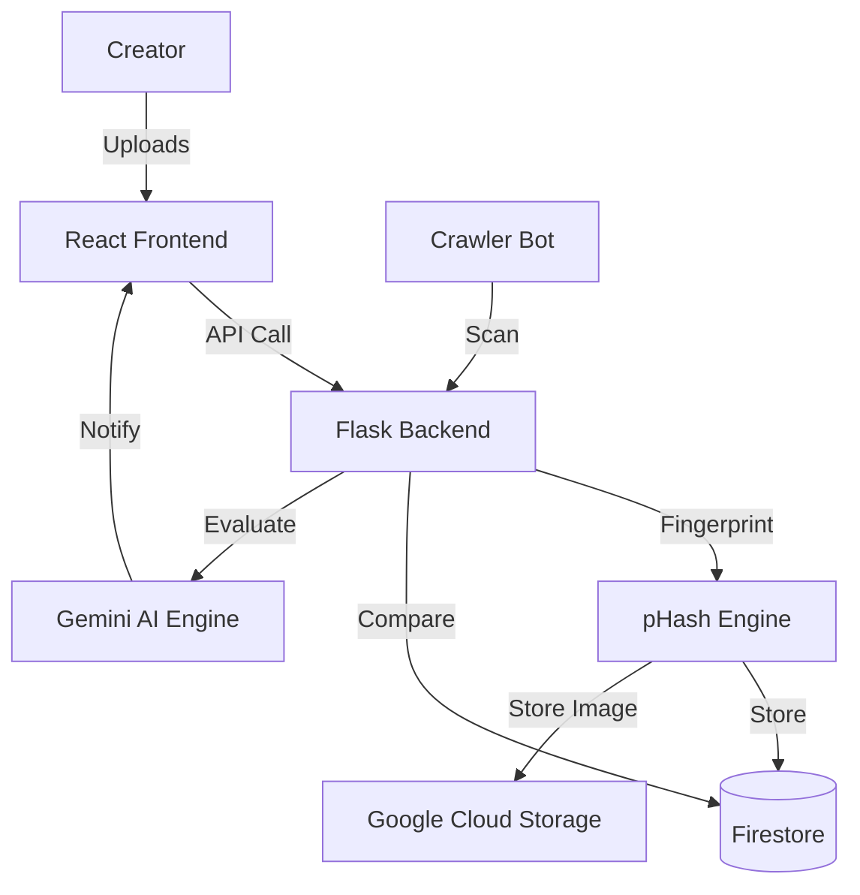

# 🛡️ Kinetic Armor
### Advanced AI-Powered Copyright Protection & Perceptual Monitoring

**🔗 [Live Production Site](https://kinetic-armor.web.app)** | **⚡ [Backend API](https://kinetic-backend-22665471971.us-central1.run.app)**

---



## 📌 Overview
Kinetic Armor is a state-of-the-art asset protection engine designed for the modern creator economy. Built for the **Google Solution Challenge 2026**, it leverages **Perceptual Hashing (pHash)** and **Generative AI** to detect, analyze, and mitigate copyright infringement in real-time across the web.

Unlike traditional MD5 hashing, Kinetic Armor identifies "near-matches"—images that have been resized, compressed, or slightly color-shifted—ensuring that stolen content cannot hide behind simple edits.

## 🚀 Key Features
- **🧬 Perceptual Hashing (pHash):** Robust image fingerprinting that detects alterations, filters, and resizing.
- **⚡ Real-time Live Ticker:** A high-performance dashboard that streams violations as they are detected.
- **🧠 AI Violation Evaluator:** Automatically analyzes the context of an infringement and generates ready-to-send DMCA notices.
- **☁️ Cloud-Native Architecture:** Fully serverless deployment using Google Cloud Run, Firestore, and GCS.
- **🛠️ Automated Vaulting:** Batch-register assets to create a secure fingerprint database.

## 🛠️ Tech Stack
- **Frontend:** React 18, Vite, Tailwind CSS, Framer Motion (for high-fidelity animations).
- **Backend:** Python Flask, SQLAlchemy, ImageHash.
- **Cloud (GCP):**
  - **Cloud Run:** Scalable serverless backend.
  - **Firestore:** Real-time NoSQL database for assets and violations.
  - **Cloud Storage:** Secure vaulting for original high-res assets.
  - **Firebase Hosting:** Global CDN for the frontend.

## 📦 Getting Started

### Prerequisites
- Python 3.9+
- Node.js 18+
- Google Cloud SDK (for deployment)

### Local Setup
1. **Clone the Repo:**
   ```bash
   git clone https://github.com/Wrathemperor/Kinetic-Armor.git
   cd Kinetic-Armor
   ```

2. **Backend Configuration:**
   ```bash
   cd backend
   python -m venv venv
   source venv/bin/activate # Windows: venv\Scripts\activate
   pip install -r requirements.txt
   ```
   Create a `.env` file with your `FIREBASE_PROJECT_ID` and GCP credentials.

3. **Frontend Configuration:**
   ```bash
   cd ..
   npm install
   npm run dev
   ```

## 🏗️ Architecture


## 📄 License
Distributed under the MIT License. See `LICENSE` for more information.

---

**Made with ❤️ by [Anvay](https://macroinvincible.com) for the Google Solution Challenge 2026.**
